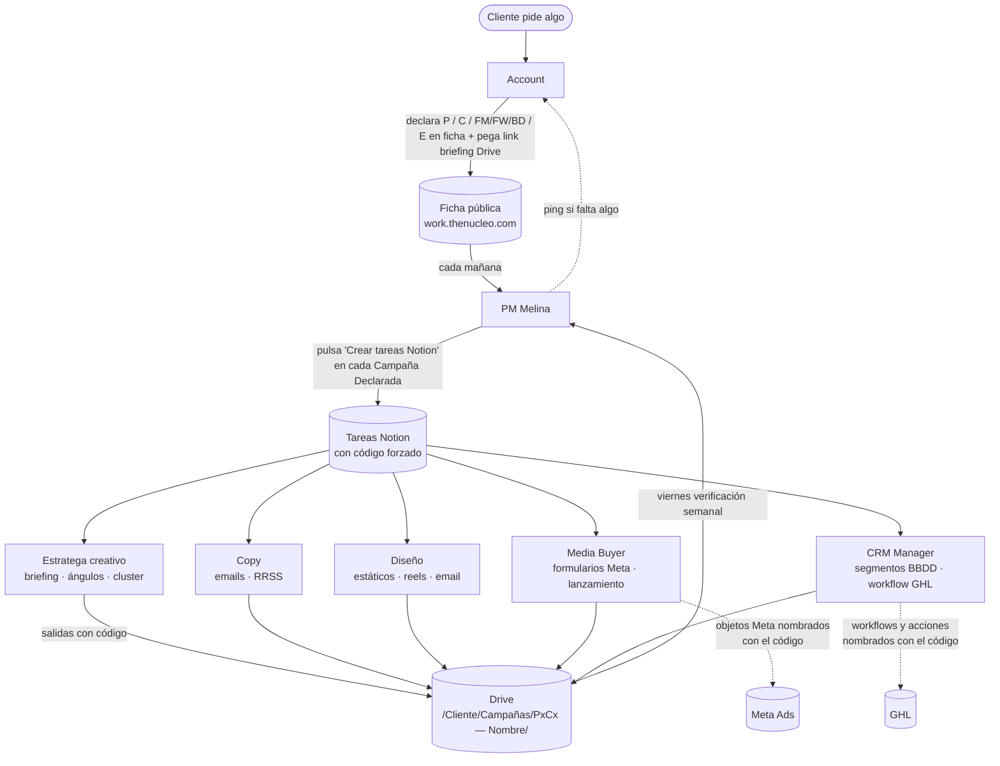

# Pipelines y Campañas — la presentación del cambio en 1 página

Audiencia: Account, PM, Equipo (Copy, Diseño, Media Buyer, CRM). Léelo entero, te lleva 4 minutos. Si después de leerlo tienes dudas, no improvises — pregunta.

---

## El antes y el después

| Antes | Después |
|---|---|
| Account cuenta el cambio en daily. Se anota dos veces (chat + Notion). | Account vuelca el cambio en **un sitio único**: la ficha del cliente, sección "Pipelines y Campañas". |
| La PM crea tareas con nombres genéricos ("Lanzamiento de campañas", "Maquetar email"). | La PM crea tareas con **código** en el título: `P1C1E2 — Copy Dra. Neuss`. |
| El equipo necesita preguntar para entender qué es cada tarea. | El equipo abre la ficha, busca el código y ve briefing + contexto. |
| Áreas duplicadas: `PAID MEDIA`, `Meta Ads`, `Media Buyer` para la misma persona. | Áreas canónicas: una sola etiqueta por canal. |
| Tareas duplicadas (3 "píxeles" para lo mismo en la misma semana). | El código forzado las hace imposibles. |
| Cuando alguien se va o entra, hay que reunirse para explicar. | El código se lee solo: `P1C1E2` te dice exactamente qué es y dónde está. |

---

## La regla mental que lo explica todo

Cada cosa que producimos para un cliente tiene una **dirección postal** que la ubica.

> `[Cliente] > [Pipeline] > [Campaña] > [Trigger o Email]`

Como Madrid > Salamanca > Velázquez > 5. Esa dirección se escribe en código (`P1C1FM1E1`) y se usa **exactamente igual** en Drive, Notion, GHL y los chats del equipo. Si cambia entre sistemas, se rompe la cadena.

---

## Los 3 roles y qué hace cada uno

| Rol | Crea | Consume | Edita la ficha |
|---|---|---|---|
| **Account** | Direcciones (códigos) | El feedback del cliente | Sí, completa |
| **PM** (Melina) | Tareas Notion con código del catálogo | El árbol del cliente | Sí, solo estado |
| **Equipo** (Estratega · Copy · Diseño · Media Buyer · CRM) | Entregables en Drive con el código en el nombre | Tarea Notion + briefing Drive | No entra |

**No hay tarea sin código. No hay código sin Account. No hay Account inventando dos veces lo mismo.**

## Flujo end-to-end del cambio

El equipo NO entra a la ficha. Trabaja con tarea Notion (código en el título) + Drive (carpeta con el código). Si una pieza acaba en Meta o GHL, también se nombra con el código. La cadena es: **un único código viaja por Notion → Drive → Meta/GHL** sin renombrarse.

## Tabla maestra — qué entregable va a qué rol

| Código del entregable | Quién lo hace | Área Notion canónica |
|---|---|---|
| `PxCx_briefing` / `_angulos` / `_cluster` / `_briefing_estaticos` / `_briefing_video` | **Estratega creativo** (Valen / Valentina) | Estrategia |
| `PxCxEn_copy` / `PxCx_copy_RRSS_vN` / `PxCx_copy_estaticos` | **Copy** (Valen / Valentin Arias) | Copy · Newsletter |
| `PxCxEn_diseno` / `PxCx_estatico_vN` / `PxCx_reel_vN` / `PxCx_carrusel_vN` / `PxCx_video` | **Diseño** (Valentin Arias · Joaquin Rojo) | Diseño |
| `PxCxFMn_form` · `_pixel` · `_estaticos_subir` · `PxCx_lanzar` | **Media Buyer** (Damian) | Meta Ads |
| `PxCxFWn_form` · `PxCxBDn_segmento` · `PxCx_ghl` · `PxCxEn_montaje` | **CRM Manager** (Camilo Balanta) | CRM |

**Áreas canónicas** (definitivas, sin duplicados): Estrategia · Copy · Newsletter · Diseño · Meta Ads · CRM · RRSS. Se acabaron las 3 etiquetas distintas (`PAID MEDIA` / `Meta Ads` / `Media Buyer`) para Damian.

**El orden importa**: Estratega → Copy → Diseño → Media Buyer/CRM. Si tu rol depende de un input anterior, esperas. La PM no genera tareas de la fase N hasta que la fase N-1 esté Lista.

---

## Las 3 reglas que nadie rompe

1. **Si no está en la ficha del cliente, no existe.** Lo que se queda en un chat o en la cabeza de alguien, se pierde.
2. **Quien necesita una dirección nueva la pide a Account.** El equipo no inventa códigos. La PM no inventa códigos. Solo Account los crea.
3. **Una dirección no se borra ni se reutiliza.** Si una Campaña deja de funcionar, se archiva. El número avanza, nunca retrocede. La ficha conserva el histórico para auditoría.

---

## Qué ves al abrir la ficha hoy

`work.thenucleo.com/ficha-cliente/?id=<cliente>` → sección **"Pipelines y Campañas"**:

- **Sidebar izquierdo**: árbol con todos los Pipelines del cliente, sus Campañas, sus Triggers y sus Emails. Cada uno con su código y su estado.
- **Panel derecho**: detalle del elemento seleccionado. Si eres Account, editas en sitio. Si eres PM, ves un botón grande "Crear tareas Notion" por Campaña.
- **Toggle "Mostrar archivados"**: ves todo lo que existió, incluido lo que ya no se usa.
- **Switch Account / PM** arriba: cambia lo que se ve según el rol.

Encima de Pipelines siguen Datos del cliente y Servicios contratados (lo de antes, sin cambios). Debajo de Pipelines, Catálogos y Anomalías siguen como MOCKUP — esas dos se rellenarán en otra fase.

---

## Qué pasa si no seguimos esto

- Vuelven los **3 píxeles duplicados** que tuvo Neus la semana del 22-may.
- Vuelve **"Lanzamiento de campañas"** sin contexto (lo tuvimos 3 veces en 7 días).
- Vuelve **Melina como único nodo** que sabe qué pasa en cada cliente — bottleneck garantizado.
- Vuelven las **reuniones de "ponerse en contexto"** cada vez que alguien recibe una tarea.

No hay versión light de esto. O lo seguimos todos o no funciona.

---

## Calendario del cambio

| Cuándo | Qué pasa | Quién hace |
|---|---|---|
| **Ya** | Módulo vivo en frontend con datos seed de Dra. Neuss. | — |
| **Esta semana** | Account vuelca el mapa real de 3-5 clientes piloto. Neus el primero. | Melina + Ben |
| **Próxima semana** | PM empieza a crear tareas Notion con código en el título (manualmente, sin dropdown forzado todavía). | Melina |
| **Cuando salga F2** | Backend Supabase conectado + dropdown forzado en el formulario "Crear tarea" de Bubble. | Sesión técnica posterior |
| **Cuando F2 esté validado** | Catálogo abierto de Plantillas + creación de plantillas nuevas. | Account + Ben |

---

## Dónde está la documentación

- **Visión operacional completa** (la "biblia"): [[ficha-cliente]]
- **Manual Account paso a paso**: [[account-manual-pipelines]]
- **Manual PM paso a paso**: [[pm-manual-pipelines]]
- **Manual del equipo paso a paso** (Estratega · Copy · Diseño · Media Buyer · CRM): [[equipo-manual-pipelines]]
- **Nomenclatura original** (12 casos, 7 reglas): `TheNucleoNomenclatura2.docx` (Drive)

---

## Si algo no encaja

Habla con Ben. No inventes una solución por tu cuenta — apunta el caso y se evalúa. La nomenclatura está pensada para casos típicos. Las excepciones se diseñan, no se improvisan.
